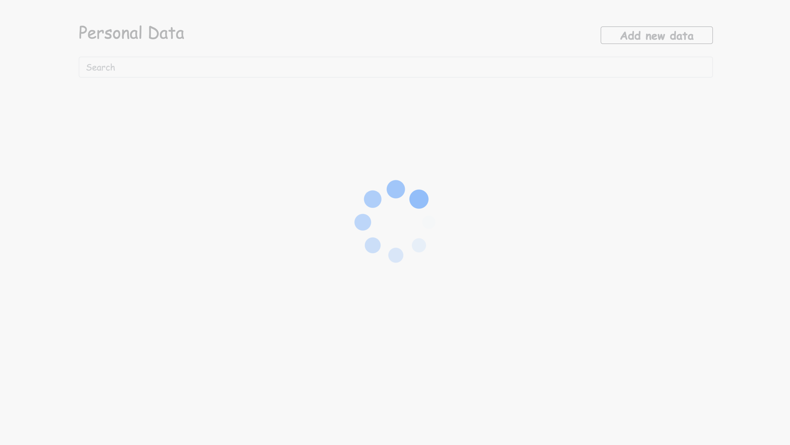
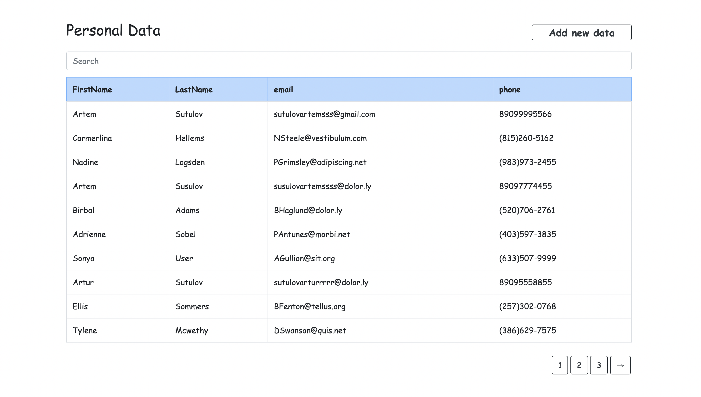
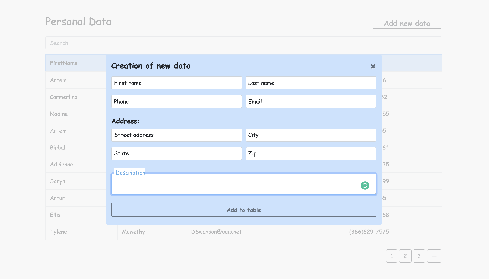
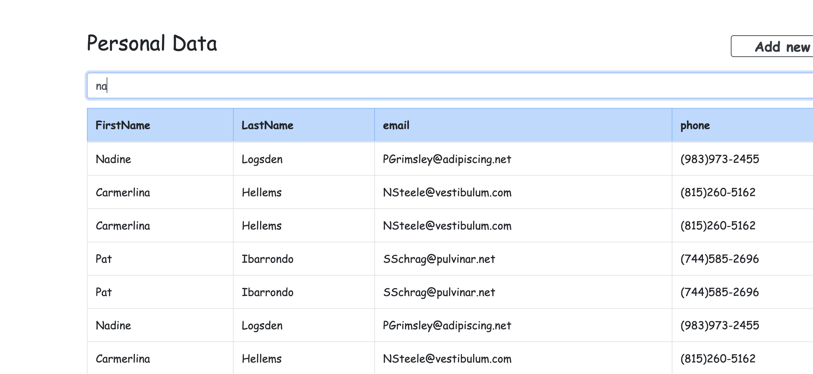
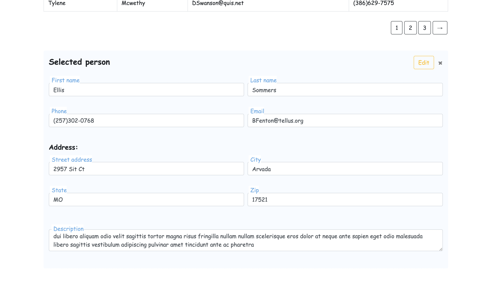
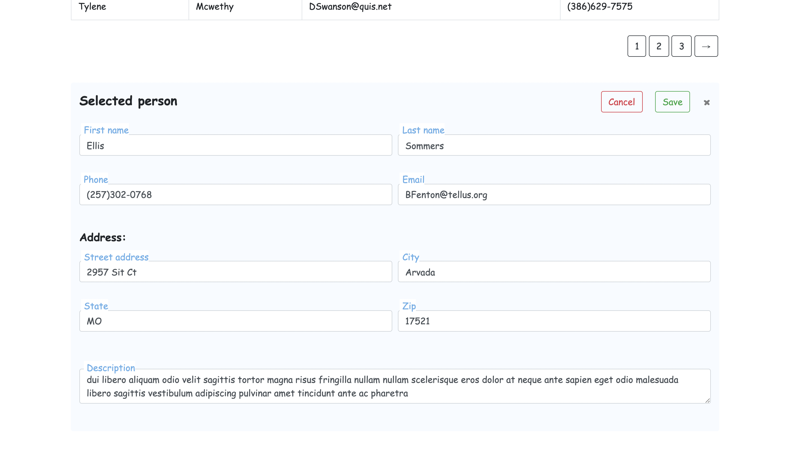

## Demo users table ( pictures below ↓ )

This app can: 
- add data to table;
- create new users; 
- see details about one user below table.

This app has:
- sorting;
- pagination;
- search.

## To see app working, firstly you need to start back.

### For start backend

- cd backend
- chmod +x wait-for.sh
- cd env/dev
- docker-compose up

#### for reset db use 

- docker-compose down -v

### For start frontend

- npm i
- npm start

### see app in http://localhost:8080 or http://localhost:3000

